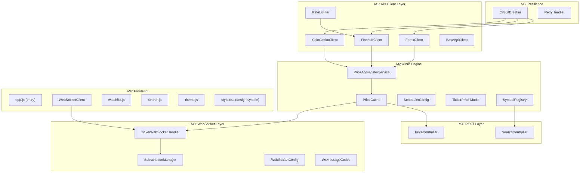
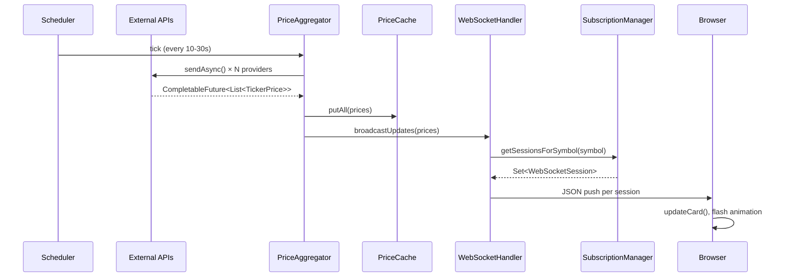
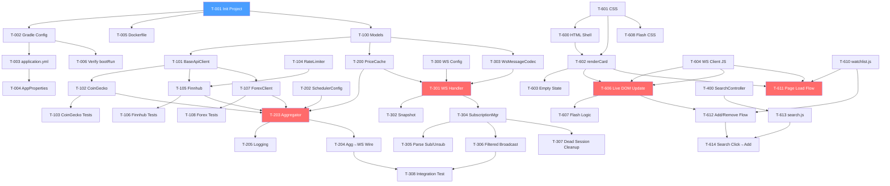

# Finance-Ticker — Architecture & Engineering Task Board

**Source:** [PRD](file:///c:/Users/kapur/Desktop/projekt%20ferrero/Crypto-Ticker-CLI/PRD_Finance_Ticker_WebApp.md) · [Execution Plan](file:///c:/Users/kapur/Desktop/projekt%20ferrero/Crypto-Ticker-CLI/Implementation_Plan_Finance_Ticker.md)

**Complexity:** E = Easy (~1-2h) · M = Medium (~3-5h) · H = Hard (~6-8h+)

---

# Part 1 — Software Architecture

## 1.1 High-Level System Design

Refer to [PRD §5.1](file:///c:/Users/kapur/Desktop/projekt%20ferrero/Crypto-Ticker-CLI/PRD_Finance_Ticker_WebApp.md) for the full architecture diagram. Summary:

```
External APIs ──[HTTP poll 5-30s]──▶ Java 17 Backend ──[WebSocket push]──▶ Browser UI
```

## 1.2 Key Modules



## 1.3 Data Flow



## 1.4 Concurrency Model

| Concern | Mechanism | Detail |
|---------|-----------|--------|
| API polling | `CompletableFuture` + `HttpClient.sendAsync()` | Fan-out to all providers, `allOf()` to join. See [PRD §5.3](file:///c:/Users/kapur/Desktop/projekt%20ferrero/Crypto-Ticker-CLI/PRD_Finance_Ticker_WebApp.md) for code sample. |
| Scheduling | Spring `@Scheduled` | Separate fixed-rate for crypto (10s), stocks (15s), forex (30min) |
| Thread pool | `Executors.newFixedThreadPool(8)` | Shared by `HttpClient`; bounded to prevent exhaustion |
| Timeouts | `CompletableFuture.orTimeout(5, SECONDS)` | Prevents hung API calls from blocking the pool |
| Shared state | `ConcurrentHashMap` | `PriceCache` and `SubscriptionManager` — lock-free reads |
| WebSocket push | Synchronous write on Tomcat NIO thread | Fast (serialized JSON < 1KB); no queuing needed for ≤10 clients |
| Frontend | Single-threaded JS event loop | `WebSocket.onmessage` → DOM update → CSS animation |

## 1.5 Package Structure

```
src/main/java/com/financeticker/
├── FinanceTickerApplication.java
├── config/
│   ├── WebSocketConfig.java
│   ├── SchedulerConfig.java
│   └── AppProperties.java
├── model/
│   ├── TickerPrice.java          (record)
│   ├── AssetClass.java           (enum)
│   └── WsMessage.java            (record: type + data)
├── client/
│   ├── BaseApiClient.java        (abstract: shared HttpClient, parsing)
│   ├── CoinGeckoClient.java
│   ├── FinnhubClient.java
│   ├── ForexClient.java
│   └── RateLimiter.java
├── service/
│   ├── PriceAggregatorService.java
│   ├── PriceCache.java
│   └── SymbolRegistry.java
├── websocket/
│   ├── TickerWebSocketHandler.java
│   └── SubscriptionManager.java
├── controller/
│   ├── PriceController.java
│   └── SearchController.java
└── resilience/
    ├── CircuitBreaker.java
    └── RetryHandler.java

src/main/resources/
├── static/
│   ├── index.html
│   ├── style.css
│   ├── app.js
│   ├── ws-client.js
│   ├── watchlist.js
│   ├── search.js
│   └── theme.js
├── symbols.json
└── application.yml
```

---

# Part 2 — Engineering Task Board

## Module M1: API Client Layer

*Source stories: US-2.1, US-2.2, US-2.3 — see [Execution Plan](file:///c:/Users/kapur/Desktop/projekt%20ferrero/Crypto-Ticker-CLI/Implementation_Plan_Finance_Ticker.md)*

| ID | Task | Complexity | Depends On | Story |
|----|------|:---:|------------|-------|
| T-100 | Create `TickerPrice` record + `AssetClass` enum + `WsMessage` record | E | — | US-2.1 |
| T-101 | Create `BaseApiClient` — shared `HttpClient` instance, `sendAsync` helper, JSON parse util | M | T-100 | US-2.1 |
| T-102 | Implement `CoinGeckoClient.fetchPrices(List<String>)` → `CompletableFuture<List<TickerPrice>>` using `/simple/price` bulk endpoint | M | T-101 | US-2.1 |
| T-103 | Unit test `CoinGeckoClient` with mocked HTTP responses (success, 429, 5xx, malformed JSON) | M | T-102 | US-2.1 |
| T-104 | Implement `RateLimiter` — token-bucket, configurable rate per provider | M | — | US-2.2 |
| T-105 | Implement `FinnhubClient.fetchPrice(String)` → `CompletableFuture<TickerPrice>` with rate limiter | M | T-101, T-104 | US-2.2 |
| T-106 | Unit test `FinnhubClient` + rate limiter behavior | M | T-105 | US-2.2 |
| T-107 | Implement `ForexClient.fetchRates(String base)` → `CompletableFuture<List<TickerPrice>>` with 30min TTL cache | M | T-101 | US-2.3 |
| T-108 | Unit test `ForexClient` with cache hit/miss scenarios | E | T-107 | US-2.3 |
| T-109 | Create `symbols.json` — ~500 popular symbols (stocks, crypto, forex) with name + asset class + provider-specific IDs | M | — | US-6.2 |

---

## Module M2: Core Engine

*Source stories: US-3.1 — see [Execution Plan](file:///c:/Users/kapur/Desktop/projekt%20ferrero/Crypto-Ticker-CLI/Implementation_Plan_Finance_Ticker.md)*

| ID | Task | Complexity | Depends On | Story |
|----|------|:---:|------------|-------|
| T-200 | Implement `PriceCache` — `ConcurrentHashMap<String, TickerPrice>`, `get()`, `putAll()`, `getAll()`, stale-check method | M | T-100 | US-3.1 |
| T-201 | Implement `SymbolRegistry` — load `symbols.json`, lookup by symbol/name, prefix search | M | T-109 | US-6.2 |
| T-202 | Create `SchedulerConfig` — enable `@EnableScheduling`, configure thread pool | E | — | US-3.1 |
| T-203 | Implement `PriceAggregatorService` — `@Scheduled` methods for crypto (10s), stocks (15s), forex (30min) | H | T-102, T-105, T-107, T-200, T-202 | US-3.1 |
| T-204 | Wire aggregator → cache → WebSocket broadcaster notification on each poll cycle | M | T-203, T-300 | US-3.1 |
| T-205 | Add logging: cycle duration, symbols fetched, failures per cycle | E | T-203 | US-3.1 |

---

## Module M3: WebSocket Layer

*Source stories: US-4.1, US-4.2 — see [Execution Plan](file:///c:/Users/kapur/Desktop/projekt%20ferrero/Crypto-Ticker-CLI/Implementation_Plan_Finance_Ticker.md)*

| ID | Task | Complexity | Depends On | Story |
|----|------|:---:|------------|-------|
| T-300 | Create `WebSocketConfig` — register handler at `/ws/prices`, configure allowed origins | E | — | US-4.1 |
| T-301 | Implement `TickerWebSocketHandler` — `afterConnectionEstablished`, `handleTextMessage`, `afterConnectionClosed` | H | T-300, T-200 | US-4.1 |
| T-302 | On connect: send snapshot of all cached prices as JSON array | M | T-301, T-200 | US-4.1 |
| T-303 | Implement `WsMessageCodec` — serialize/deserialize `WsMessage` with Jackson | E | T-100 | US-4.1 |
| T-304 | Implement `SubscriptionManager` — `subscribe(session, symbols)`, `unsubscribe(session, symbols)`, `getSessionsFor(symbol)`, `removeSession(session)` | H | T-301 | US-4.2 |
| T-305 | Parse incoming `SUBSCRIBE`/`UNSUBSCRIBE` JSON messages in handler, delegate to `SubscriptionManager` | M | T-304, T-303 | US-4.2 |
| T-306 | Implement filtered broadcast: on price update, push only to sessions subscribed to that symbol | M | T-304, T-204 | US-4.2 |
| T-307 | Add periodic dead-session cleanup (every 60s, remove closed sessions) | E | T-304 | US-4.2 |
| T-308 | Integration test: connect WS client → subscribe → verify `PRICE_UPDATE` messages received | M | T-306 | US-4.1 |

---

## Module M4: REST Layer

*Source stories: US-6.2, US-8.3 — see [Execution Plan](file:///c:/Users/kapur/Desktop/projekt%20ferrero/Crypto-Ticker-CLI/Implementation_Plan_Finance_Ticker.md)*

| ID | Task | Complexity | Depends On | Story |
|----|------|:---:|------------|-------|
| T-400 | Create `SearchController` — `GET /api/search?q={query}`, return top 10 prefix matches from `SymbolRegistry` | E | T-201 | US-6.2 |
| T-401 | Create `PriceController` — `GET /api/prices?symbols=AAPL,BTC`, return cached `TickerPrice[]` | E | T-200 | US-8.3 |
| T-402 | Add CORS config via `WebMvcConfigurer` for dev flexibility | E | — | US-8.3 |

---

## Module M5: Resilience

*Source stories: US-7.1 — see [Execution Plan](file:///c:/Users/kapur/Desktop/projekt%20ferrero/Crypto-Ticker-CLI/Implementation_Plan_Finance_Ticker.md)*

| ID | Task | Complexity | Depends On | Story |
|----|------|:---:|------------|-------|
| T-500 | Implement `CircuitBreaker` — states: `CLOSED`/`OPEN`/`HALF_OPEN`, configurable failure threshold (3) and cooldown (30s) | H | — | US-7.1 |
| T-501 | Implement `RetryHandler` — 1 retry with exponential backoff (1s, 2s), wraps `CompletableFuture` | M | — | US-7.1 |
| T-502 | Integrate circuit breaker + retry into each API client (`CoinGecko`, `Finnhub`, `Forex`) | M | T-500, T-501, T-102, T-105, T-107 | US-7.1 |
| T-503 | On failure: return `Optional.empty()`, keep existing cached value, log warning | E | T-502, T-200 | US-7.1 |
| T-504 | Add `isStale` field to `TickerPrice` (true if age > 30s); set on cache read | E | T-200 | US-7.1 |
| T-505 | Add `CompletableFuture.orTimeout(5, SECONDS)` to all API calls | E | T-102, T-105, T-107 | US-7.1 |
| T-506 | Unit test circuit breaker state transitions + retry behavior | M | T-500, T-501 | US-7.1 |

---

## Module M6: Frontend

*Source stories: US-5.1, US-5.2, US-6.1, US-6.2, US-7.2, US-8.1, US-8.2 — see [Execution Plan](file:///c:/Users/kapur/Desktop/projekt%20ferrero/Crypto-Ticker-CLI/Implementation_Plan_Finance_Ticker.md)*

| ID | Task | Complexity | Depends On | Story |
|----|------|:---:|------------|-------|
| T-600 | Create `index.html` — app shell: header (logo, search, theme toggle), grid container, footer (status bar) | M | — | US-5.1 |
| T-601 | Create `style.css` — design system: CSS custom properties (both themes), typography (Inter via Google Fonts), card component, grid layout, animations | H | — | US-5.1 |
| T-602 | Implement `renderCard(ticker)` in `app.js` — create/update card DOM element with symbol, badge, price, change%, timestamp, remove button | M | T-600, T-601 | US-5.1 |
| T-603 | Implement empty state UI — "Add your first ticker" prompt when watchlist is empty | E | T-602 | US-5.1 |
| T-604 | Create `ws-client.js` — `WebSocketClient` class: connect, send, onmessage dispatch, close | M | — | US-5.2 |
| T-605 | Implement `ReconnectingWebSocket` wrapper — exponential backoff (1s→30s) with jitter, auto re-subscribe on reconnect | H | T-604 | US-7.2 |
| T-606 | On `PRICE_UPDATE` message: find card by `data-symbol` → update price/change/timestamp DOM nodes | M | T-602, T-604 | US-5.2 |
| T-607 | Implement flash animation: compare old vs new price → add `.flash-up`/`.flash-down` class → remove on `animationend` | M | T-606, T-601 | US-5.2 |
| T-608 | CSS `@keyframes` for flash-green and flash-red (600ms ease-out on card border/bg) | E | T-601 | US-5.2 |
| T-609 | Show "Stale" badge on card when `isStale == true` (grayed-out card style) | E | T-602 | US-7.1 |
| T-610 | Create `watchlist.js` — `load()`, `save()`, `add(symbol)`, `remove(symbol)` using `localStorage` | M | — | US-6.1 |
| T-611 | On page load: load watchlist → render placeholder cards → connect WS → send `SUBSCRIBE` for all symbols | M | T-610, T-602, T-604 | US-6.1 |
| T-612 | On add: update watchlist → render card → send `SUBSCRIBE`. On remove: update watchlist → remove card → send `UNSUBSCRIBE` | M | T-610, T-606 | US-6.1 |
| T-613 | Create `search.js` — search input with 300ms debounce, fetch `GET /api/search?q=`, render dropdown results | M | T-400 | US-6.2 |
| T-614 | Handle search result click → add symbol to watchlist (via T-612 flow) | E | T-613, T-612 | US-6.2 |
| T-615 | Implement connection status indicator in footer — bind to WS `onopen`/`onclose`/`onerror` → update dot color + text | E | T-604 | US-8.1 |
| T-616 | Show "Disconnected — Retry" button after 60s of failed reconnects | E | T-605, T-615 | US-7.2 |
| T-617 | Create `theme.js` — read `localStorage.theme` or `prefers-color-scheme` → set `data-theme` on `<html>` | E | T-601 | US-8.2 |
| T-618 | Theme toggle button — switch `data-theme`, save to `localStorage` | E | T-617 | US-8.2 |

---

## Module M0: Scaffolding & Deployment

*Source stories: US-1.1, US-8.4 — see [Execution Plan](file:///c:/Users/kapur/Desktop/projekt%20ferrero/Crypto-Ticker-CLI/Implementation_Plan_Finance_Ticker.md)*

| ID | Task | Complexity | Depends On | Story |
|----|------|:---:|------------|-------|
| T-001 | Initialize Spring Boot 3.x via start.spring.io (deps: web, websocket, actuator) | E | — | US-1.1 |
| T-002 | Configure `build.gradle.kts` — Java 17 toolchain, Jackson, Guava (rate limiter) | E | T-001 | US-1.1 |
| T-003 | Create `application.yml` — server port, API key placeholders (`FINNHUB_KEY`, `COINGECKO_KEY`), scheduler pool size | E | T-001 | US-1.1 |
| T-004 | Create `AppProperties` config class — `@ConfigurationProperties` to bind API keys | E | T-003 | US-1.1 |
| T-005 | Create `Dockerfile` (multi-stage: gradle build → JRE 17 slim) + `docker-compose.yml` | M | T-001 | US-1.1 |
| T-006 | Verify `./gradlew bootRun` starts on port 8080, `/actuator/health` returns 200 | E | T-002 | US-1.1 |
| T-007 | Write `README.md` — prerequisites, API key setup, local run, Docker run, architecture diagram | M | All | US-8.4 |
| T-008 | Test clean-clone build: `git clone` → `./gradlew bootRun` works end-to-end | E | T-007 | US-8.4 |
| T-009 | Finalize `.gitignore`, verify Docker build succeeds | E | T-005 | US-8.4 |

---

# Part 3 — MVP Implementation Order

> [!IMPORTANT]
> Tasks are ordered so that each step produces a **testable increment**. The MVP is shippable after Phase 3.

### Phase 1: Skeleton + Data (Days 1–4)

```
T-001 → T-002 → T-003 → T-004 → T-006    Runnable Spring Boot shell
T-005                                       Docker (parallel)
T-100 → T-101                               Shared model + base client
T-109                                       Symbol registry data file
T-104                                       Rate limiter (parallel)
T-102 → T-103                               CoinGecko client + tests
T-105 → T-106                               Finnhub client + tests
T-107 → T-108                               Forex client + tests
```

**Checkpoint:** All 3 API clients fetch data independently. Verifiable via unit tests + log output.

### Phase 2: Engine + WebSocket (Days 5–7)

```
T-200 → T-202 → T-203 → T-205             Price cache + aggregator + scheduler
T-201                                       Symbol registry service (parallel)
T-300 → T-303 → T-301 → T-302             WebSocket config + handler + snapshot
T-304 → T-305 → T-306 → T-307             Subscription manager + filtered broadcast
T-204                                       Wire aggregator → WS broadcaster
T-308                                       Integration test
```

**Checkpoint:** Backend polls APIs, caches prices, pushes via WebSocket. Verifiable via `wscat ws://localhost:8080/ws/prices`.

### Phase 3: Frontend MVP (Days 8–12)

```
T-601 → T-600                               Design system + HTML shell
T-602 → T-603                               Card rendering + empty state
T-604 → T-606 → T-607 → T-608             WS client + live updates + animations
T-610 → T-611 → T-612                       Watchlist persistence
T-400 → T-613 → T-614                       Search endpoint + frontend modal
```

**🏁 MVP SHIPPABLE HERE** — Dashboard works end-to-end.

### Phase 4: Harden + Polish (Days 13–18)

```
T-500 → T-501 → T-506 → T-502 → T-503     Circuit breaker + retry + integration
T-504 → T-505 → T-609                       Stale detection + timeout + UI badge
T-605 → T-615 → T-616                       Auto-reconnect + status indicator
T-617 → T-618                               Theme toggle
T-401 → T-402                               REST fallback + CORS
T-007 → T-008 → T-009                       README + final Docker + clean-clone test
```

**Checkpoint:** Resilient, polished, documented, deployable. Ready to demo.

---

# Part 4 — Task Summary

| Module | # Tasks | E | M | H |
|--------|:-------:|:-:|:-:|:-:|
| M0 — Scaffolding & Deploy | 9 | 7 | 2 | 0 |
| M1 — API Client Layer | 10 | 2 | 7 | 1 |
| M2 — Core Engine | 6 | 2 | 3 | 1 |
| M3 — WebSocket Layer | 9 | 3 | 4 | 2 |
| M4 — REST Layer | 3 | 3 | 0 | 0 |
| M5 — Resilience | 7 | 3 | 3 | 1 |
| M6 — Frontend | 19 | 9 | 8 | 2 |
| **Total** | **63** | **29** | **27** | **7** |

**Estimated effort:** ~160–190 hours · **Critical path:** T-001 → T-101 → T-102 → T-203 → T-204 → T-301 → T-606 → T-611

---

# Part 5 — Dependency Map (Full)



🔵 Entry point · 🔴 Critical path nodes

---

> [!TIP]
> **Trello Setup:** Create 6 lists matching the modules (M0–M6). Each task ID becomes a card. Use labels for complexity (🟢 E, 🟡 M, 🔴 H). Add dependency task IDs in the card description. Move cards through `Backlog → In Progress → Review → Done`.
