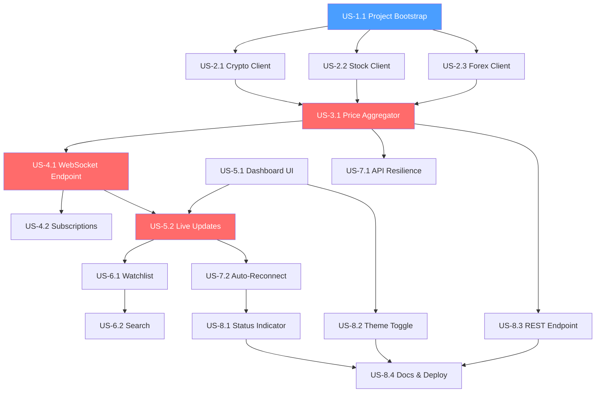

# Finance-Ticker Web App — Execution Plan

**Derived from:** [PRD_Finance_Ticker_WebApp.md](file:///c:/Users/kapur/Desktop/projekt%20ferrero/Crypto-Ticker-CLI/PRD_Finance_Ticker_WebApp.md) · **Sprint:** 3 weeks

---

## Epics Overview

| Epic | Scope | Week |
|------|-------|------|
| **E1** — Project Scaffolding & Infra | Gradle project, Spring Boot setup, Docker, CI skeleton | 1 |
| **E2** — API Client Layer | Non-blocking API clients for stocks, crypto, forex | 1 |
| **E3** — Price Aggregation Engine | Scheduler, caching, normalization | 1 |
| **E4** — WebSocket Server | Real-time push, subscription management | 1–2 |
| **E5** — Dashboard UI | Responsive grid, ticker cards, live updates | 2 |
| **E6** — Watchlist & Search | Add/remove tickers, search, localStorage persistence | 2 |
| **E7** — Resilience & Error Handling | Retry, circuit breaker, stale badges, reconnect | 3 |
| **E8** — Polish & Deployment | Theme toggle, status indicator, README, Docker | 3 |

---

## Epic E1 — Project Scaffolding & Infra

### US-1.1: Project Bootstrap

> _As a **developer**, I want a runnable Spring Boot project with Gradle so that I have a working skeleton to build on._

**Acceptance Criteria:**
- `./gradlew bootRun` starts the app on port 8080
- Health endpoint (`/actuator/health`) returns `200 OK`
- Project uses Java 17, Jackson, and Spring WebSocket dependencies

**Technical Tasks:**
1. Initialize Spring Boot 3.x project via [start.spring.io](https://start.spring.io) (deps: `web`, `websocket`, `actuator`)
2. Configure `build.gradle.kts` — Java 17 toolchain, Jackson, `java.net.http` (built-in)
3. Add `application.yml` with server port, API key placeholders
4. Create `Dockerfile` + `docker-compose.yml` (JDK 17 slim image)
5. Verify `./gradlew bootRun` and `docker compose up` both work

**Tech Approach:** Spring Boot 3.2.x, Gradle 8.x Kotlin DSL, `eclipse-temurin:17-jre` Docker base image.

---

## Epic E2 — API Client Layer

### US-2.1: Crypto Price Fetching

> _As a **user**, I want to see live crypto prices so that I can track coins like BTC and ETH._

**Acceptance Criteria:**
- Backend fetches prices for ≥5 crypto symbols from CoinGecko
- Calls are non-blocking (`HttpClient.sendAsync()`)
- Response parsed into `TickerPrice` record
- Logged to console on successful fetch

**Technical Tasks:**
1. Create `CoinGeckoClient` class
2. Implement `fetchPrices(List<String> symbols)` → `CompletableFuture<List<TickerPrice>>`
3. Use CoinGecko `/simple/price` bulk endpoint (batches up to 250 symbols)
4. Parse JSON with Jackson `ObjectMapper` into `TickerPrice`
5. Add unit test with mocked HTTP responses

**Tech Approach:** `HttpClient.sendAsync()` + `BodyHandlers.ofString()` → `thenApply(this::parse)`. Jackson `@JsonIgnoreProperties(ignoreUnknown = true)` for resilient parsing.

---

### US-2.2: Stock Price Fetching

> _As a **user**, I want to see live stock prices so that I can track tickers like AAPL and MSFT._

**Acceptance Criteria:**
- Backend fetches prices for ≥3 stock symbols from Finnhub (or Alpha Vantage)
- Calls are non-blocking
- Rate limiter respects free-tier limits (60 req/min Finnhub)

**Technical Tasks:**
1. Create `FinnhubClient` class (preferred over Alpha Vantage — better free tier)
2. Implement `fetchPrice(String symbol)` → `CompletableFuture<TickerPrice>`
3. Add token-bucket rate limiter (simple `Semaphore` or Guava `RateLimiter`)
4. Normalize symbol format and map to `TickerPrice`
5. Unit test with mocked responses + rate limiter test

**Tech Approach:** Finnhub `/quote?symbol=AAPL` endpoint. If rate limit hit, fall back to cached value. Guava `RateLimiter.create(1.0)` for 1 req/sec pacing.

---

### US-2.3: Forex Rate Fetching

> _As a **user**, I want to see forex exchange rates so that I can track currency pairs like EUR/USD._

**Acceptance Criteria:**
- Backend fetches ≥3 forex pairs from ExchangeRate-API
- Refreshes every 30 minutes (forex moves slowly + tight rate limits)

**Technical Tasks:**
1. Create `ForexClient` class
2. Implement `fetchRates(String baseCurrency)` → `CompletableFuture<List<TickerPrice>>`
3. Cache responses for 30 min (simple `ConcurrentHashMap` with TTL)
4. Unit test

**Tech Approach:** ExchangeRate-API `/latest/{base}` endpoint. Cache in a `ConcurrentHashMap<String, CachedEntry>` with timestamp-based expiry.

---

## Epic E3 — Price Aggregation Engine

### US-3.1: Scheduled Price Polling

> _As the **system**, I need to poll APIs on a schedule so that price data stays fresh without exceeding rate limits._

**Acceptance Criteria:**
- Scheduler fires every 10 seconds for crypto, every 15 seconds for stocks, every 30 minutes for forex
- All fetches run concurrently via `CompletableFuture.allOf()`
- Results written to an in-memory price cache

**Technical Tasks:**
1. Create `PriceAggregatorService` with `@Scheduled` methods
2. Implement `PriceCache` — `ConcurrentHashMap<String, TickerPrice>` with last-updated timestamps
3. On each poll cycle: fan-out to all clients → `allOf()` → write cache → notify WebSocket subscribers
4. Log cycle duration and any failures

**Tech Approach:** Spring `@Scheduled(fixedRate = 10000)`. `PriceCache` is a singleton bean. Fire `ApplicationEvent` or direct call to WebSocket broadcaster after cache update.

> [!IMPORTANT]
> **Dependency:** Requires US-2.1, US-2.2, US-2.3 (API clients must exist before aggregation).

---

## Epic E4 — WebSocket Server

### US-4.1: WebSocket Endpoint

> _As a **frontend client**, I want to connect to a WebSocket so that I receive price updates in real time without polling._

**Acceptance Criteria:**
- WebSocket endpoint at `ws://localhost:8080/ws/prices` accepts connections
- On connect, server sends latest cached prices for default/subscribed symbols
- JSON message format matches PRD spec (`type: PRICE_UPDATE`)

**Technical Tasks:**
1. Configure `WebSocketConfigurer` + `TextWebSocketHandler`
2. Implement `TickerWebSocketHandler` — manage sessions, parse incoming messages
3. On connect: send snapshot of all cached prices
4. On cache update: broadcast to all connected sessions
5. Integration test: connect via WS client, verify message format

**Tech Approach:** Spring `WebSocketHandler` with `TextWebSocketHandler`. Store sessions in `CopyOnWriteArrayList<WebSocketSession>`. Serialize with Jackson.

---

### US-4.2: Per-Client Subscriptions

> _As a **user**, I want to subscribe to specific symbols so that I only receive updates for tickers I care about._

**Acceptance Criteria:**
- Client sends `{"type": "SUBSCRIBE", "symbols": ["AAPL","BTC"]}` → server tracks subscription
- Client sends `{"type": "UNSUBSCRIBE", "symbols": ["AAPL"]}` → server stops pushing AAPL
- Only subscribed symbols are pushed per session

**Technical Tasks:**
1. Create `SubscriptionManager` — `Map<WebSocketSession, Set<String>>`
2. Parse incoming `SUBSCRIBE`/`UNSUBSCRIBE` messages in handler
3. Filter broadcasts: only send `TickerPrice` if symbol ∈ session's subscription set
4. Clean up subscriptions on session close

**Tech Approach:** `ConcurrentHashMap<String, Set<WebSocketSession>>` (symbol → sessions) for efficient broadcast fan-out.

> [!IMPORTANT]
> **Dependency:** Requires US-4.1 (WebSocket endpoint) and US-3.1 (price cache must be populated).

---

## Epic E5 — Dashboard UI

### US-5.1: Dashboard Layout & Ticker Cards

> _As a **user**, I want a responsive grid of ticker cards so that I can see all my tracked assets at a glance._

**Acceptance Criteria:**
- Dashboard renders a CSS Grid of cards (3 columns desktop, 2 tablet, 1 mobile)
- Each card shows: symbol, asset class badge, price, 24h change %, timestamp
- Empty state shows "Add your first ticker" prompt

**Technical Tasks:**
1. Create `index.html` — app shell with header, grid container, footer
2. Create `style.css` — design system (colors, typography, card styles, grid, dark theme vars)
3. Create `app.js` — main entry, DOM manipulation, card rendering
4. Implement `renderCard(ticker)` function
5. Add Google Fonts (Inter), CSS custom properties for theming

**Tech Approach:** Vanilla JS DOM manipulation. CSS Grid with `auto-fill` + `minmax()`. CSS custom properties (`--color-bg`, `--color-card`) for theme support. Serve static files from Spring Boot `src/main/resources/static/`.

---

### US-5.2: Live Price Updates with Animation

> _As a **user**, I want to see prices update in real time with visual feedback so that I can instantly spot movements._

**Acceptance Criteria:**
- Prices update on the card without full page reload
- Price increase → card border/bg flashes green for 600ms
- Price decrease → card border/bg flashes red for 600ms
- Timestamp updates on each tick

**Technical Tasks:**
1. Create `WebSocketClient` class in JS — connect, reconnect, parse messages
2. On `PRICE_UPDATE` message: find card by symbol → update price/change/timestamp
3. Compare new price vs. old → add CSS class `.flash-up` or `.flash-down`
4. CSS animation: `@keyframes flash-green` / `@keyframes flash-red` — 600ms ease-out
5. Remove animation class after transition ends (`animationend` event)

**Tech Approach:** `new WebSocket('ws://...')` in JS. `requestAnimationFrame` for batched DOM updates. CSS-only animations (no JS timers for visual effects).

> [!IMPORTANT]
> **Dependency:** Requires US-4.1 (WebSocket server must be running) and US-5.1 (cards must exist to update).

---

## Epic E6 — Watchlist & Search

### US-6.1: Watchlist Persistence

> _As a **user**, I want my watchlist to survive page reloads so that I don't have to re-add tickers every time._

**Acceptance Criteria:**
- Watchlist stored in `localStorage` as JSON array of symbols
- On page load: read watchlist → render cards → send `SUBSCRIBE`
- Adding/removing a ticker updates `localStorage` immediately

**Technical Tasks:**
1. Create `watchlist.js` module — `load()`, `save()`, `add(symbol)`, `remove(symbol)`
2. On page load: `watchlist.load()` → for each symbol, render placeholder card + subscribe
3. On add: `watchlist.add()` → render card → subscribe
4. On remove: `watchlist.remove()` → remove card DOM → unsubscribe

---

### US-6.2: Symbol Search

> _As a **user**, I want to search for a ticker symbol so that I can find and add assets to my watchlist._

**Acceptance Criteria:**
- Search input in header with debounced input (300ms)
- Backend endpoint `GET /api/search?q=AAP` returns matching symbols
- Results show symbol + name + asset class
- Clicking a result adds it to watchlist

**Technical Tasks:**
1. Backend: Create `SearchController` — `GET /api/search?q={query}`
2. Backend: Maintain a static symbol list (JSON file of ~500 popular symbols with metadata)
3. Backend: Filter by prefix match, return top 10 results
4. Frontend: Search modal/dropdown with debounced input
5. Frontend: Render results, handle click → add to watchlist

**Tech Approach:** Pre-loaded `symbols.json` in classpath. Filter with `String.startsWith()` (sufficient for MVP; no Elasticsearch). Frontend: `<input>` with `setTimeout` debounce.

> [!IMPORTANT]
> **Dependency:** Requires US-6.1 (watchlist module) for the "add" action.

---

## Epic E7 — Resilience & Error Handling

### US-7.1: API Failure Recovery

> _As a **user**, I want the dashboard to keep working even if an API goes down so that I always see the last known prices._

**Acceptance Criteria:**
- On API failure: serve last cached price with a "stale" visual indicator
- After 3 consecutive failures to the same provider: circuit opens, retries after 30s
- No unhandled exceptions in server logs

**Technical Tasks:**
1. Add retry logic to each API client (1 retry, exponential backoff)
2. Implement simple circuit breaker (enum: `CLOSED`, `OPEN`, `HALF_OPEN`; counter-based)
3. On failure: log warning, return `Optional.empty()`, keep cached value in `PriceCache`
4. Add `isStale` flag to `TickerPrice` (true if age > 30s)
5. Frontend: gray out card + show "Stale" badge if `isStale == true`

**Tech Approach:** Hand-rolled circuit breaker (3 failures → open for 30s → half-open → test one request). Avoids Resilience4j dependency for MVP simplicity.

---

### US-7.2: WebSocket Auto-Reconnect

> _As a **user**, I want the dashboard to automatically reconnect if the WebSocket drops so that I don't have to manually refresh._

**Acceptance Criteria:**
- On WebSocket close/error: attempt reconnect with backoff (1s, 2s, 4s, … max 30s)
- During reconnect: show "Reconnecting…" status indicator
- On reconnect: re-subscribe to all watchlist symbols
- On permanent failure (>60s): show "Disconnected" with manual retry button

**Technical Tasks:**
1. Implement `ReconnectingWebSocket` wrapper in JS
2. Exponential backoff with jitter
3. On reconnect success: re-send `SUBSCRIBE` for watchlist symbols
4. Update connection status indicator in UI

---

## Epic E8 — Polish & Deployment

### US-8.1: Connection Status Indicator

> _As a **user**, I want to see the connection status so that I know if data is live or stale._

**Acceptance Criteria:**
- Footer shows: 🟢 `Connected` / 🟡 `Reconnecting…` / 🔴 `Disconnected`
- Status updates within 1s of state change

**Technical Tasks:**
1. Add status bar element in footer
2. Bind to WebSocket `onopen`, `onclose`, `onerror` events
3. CSS: colored dot + text

---

### US-8.2: Dark/Light Theme

> _As a **user**, I want to toggle between dark and light themes so that I can use the app comfortably at any time of day._

**Acceptance Criteria:**
- Toggle button in header switches themes
- Preference stored in `localStorage`
- Defaults to `prefers-color-scheme` on first visit

**Technical Tasks:**
1. Define CSS custom properties for both themes under `[data-theme="dark"]` / `[data-theme="light"]`
2. JS: read `localStorage.theme` → set `data-theme` attribute on `<html>`
3. Toggle button: switch attribute + save to `localStorage`

---

### US-8.3: REST Fallback Endpoint

> _As a **developer**, I want a REST API to fetch current prices so that I can integrate with scripts or other tools._

**Acceptance Criteria:**
- `GET /api/prices?symbols=AAPL,BTC` returns JSON array of `TickerPrice`
- Returns cached data (no new API call triggered)

**Technical Tasks:**
1. Create `PriceController` — `@GetMapping("/api/prices")`
2. Read from `PriceCache`, filter by requested symbols
3. Return JSON response

---

### US-8.4: Documentation & Deployment

> _As a **developer**, I want clear setup docs so that I can run this project in under 5 minutes._

**Acceptance Criteria:**
- `README.md` covers: prerequisites, API key setup, run locally, run via Docker
- Architecture diagram included
- API key configuration via env vars or `application.yml`

**Technical Tasks:**
1. Write `README.md` with quick-start, architecture, config, and screenshots
2. Finalize `Dockerfile` + `docker-compose.yml`
3. Test clean-clone build: `git clone → ./gradlew bootRun` works

---

## Weekly Execution Plan

### Week 1 — Backend Core

| Day | Tasks | Stories |
|-----|-------|---------|
| D1 | Project scaffold, Gradle, Spring Boot shell, Docker skeleton | US-1.1 |
| D2 | CoinGecko client + unit tests | US-2.1 |
| D3 | Finnhub client + rate limiter + unit tests | US-2.2 |
| D4 | Forex client + cache + unit tests | US-2.3 |
| D5 | Price aggregator service + scheduled polling + price cache | US-3.1 |
| D6 | WebSocket endpoint + broadcast on cache update | US-4.1 |
| D7 | Subscription manager (SUBSCRIBE/UNSUBSCRIBE) | US-4.2 |

**Week 1 exit criteria:** Backend runs, polls 3 APIs, pushes prices over WebSocket. Verifiable via `wscat` or Postman.

---

### Week 2 — Frontend & Integration

| Day | Tasks | Stories |
|-----|-------|---------|
| D8 | Dashboard HTML/CSS shell, design system, ticker card component | US-5.1 |
| D9 | WebSocket client in JS, live DOM updates, flash animations | US-5.2 |
| D10 | Watchlist module (localStorage, add/remove, subscribe on load) | US-6.1 |
| D11 | Symbol search endpoint + frontend search modal | US-6.2 |
| D12 | End-to-end integration test: add ticker → see live updates | — |

**Week 2 exit criteria:** Fully functional dashboard. User can search, add tickers, see live prices, remove tickers, reload page — all working.

---

### Week 3 — Resilience, Polish, Ship

| Day | Tasks | Stories |
|-----|-------|---------|
| D13 | API retry + circuit breaker + stale badges | US-7.1 |
| D14 | WebSocket auto-reconnect + connection status indicator | US-7.2, US-8.1 |
| D15 | Dark/Light theme toggle | US-8.2 |
| D16 | REST fallback endpoint | US-8.3 |
| D17 | README, Docker finalization, clean-clone test | US-8.4 |
| D18 | Buffer day — bug fixes, final testing, demo prep | — |

**Week 3 exit criteria:** All acceptance criteria met. `docker compose up` works. README complete. Ready to demo.

---

## Dependency Graph

🔵 = Entry point &nbsp;&nbsp; 🔴 = Critical path

---

## Hard Technical Risks

| # | Risk | Severity | Mitigation |
|---|------|----------|------------|
| **R1** | **Alpha Vantage 25 req/day limit** makes stock data nearly unusable | 🔴 High | Use **Finnhub** (60 req/min) as primary stock provider. Keep Alpha Vantage as fallback only. |
| **R2** | **CoinGecko rate limit changes** — they recently tightened free-tier limits | 🟡 Medium | Use bulk `/simple/price` endpoint (1 call for N symbols). Monitor for 429s. Have Twelve Data as backup. |
| **R3** | **WebSocket session leaks** — sessions not cleaned up on disconnect | 🟡 Medium | Implement `afterConnectionClosed()` handler. Periodic session audit (every 60s, remove dead sessions). |
| **R4** | **JSON parsing failures** on unexpected API schema changes | 🟡 Medium | Use `@JsonIgnoreProperties(ignoreUnknown = true)`. Wrap parsing in try-catch, log and skip bad records. |
| **R5** | **Thread pool exhaustion** if API calls hang | 🔴 High | Set `HttpClient` connect/read timeout to 5s. Fixed thread pool of 8 is bounded. `CompletableFuture.orTimeout(5, SECONDS)`. |
| **R6** | **CORS issues** if frontend and backend run on different ports during dev | 🟢 Low | Serve static files from Spring Boot directly. Add `@CrossOrigin` or `WebMvcConfigurer.addCorsMappings()` as fallback. |
| **R7** | **Symbol mismatch** between providers (BTC vs bitcoin vs BTC-USD) | 🟡 Medium | Build a canonical symbol registry (`symbols.json`) with per-provider aliases. Map on ingestion. |

---

## Summary

| Metric | Value |
|--------|-------|
| **Epics** | 8 |
| **User Stories** | 14 |
| **Estimated Working Days** | 18 (3 weeks × 6 days, 1 buffer day) |
| **Critical Path** | US-1.1 → US-2.x → US-3.1 → US-4.1 → US-5.2 → US-6.1 |
| **Biggest Risk** | API rate limits on free tiers (R1, R2) |
| **MVP Shippable After** | Week 2 (core functionality complete) |
