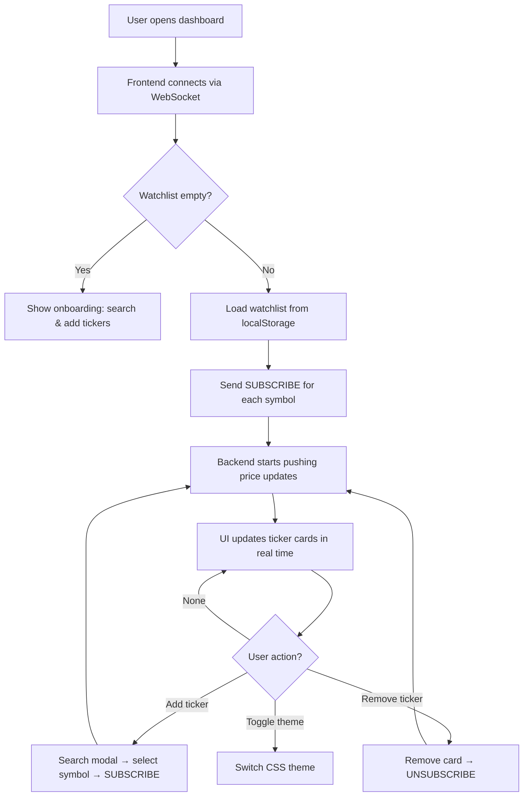
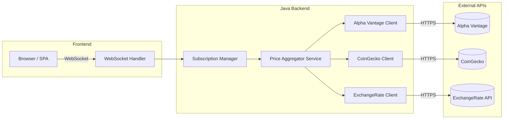

# Finance-Ticker Web App — Product Requirements Document (PRD)

**Version:** 1.0 · **Date:** 2026-04-21 · **Author:** Solo Developer · **Timeline:** 2–3 weeks

---

## 1. Product Overview

### 1.1 Problem Statement

Retail traders, hobbyist investors, and developers who follow financial markets need a lightweight, always-on dashboard to watch live price movements across multiple asset classes (stocks, crypto, forex). Most existing solutions are either:

- **Heavyweight Bloomberg/TradingView clones** — feature-bloated, slow to load, and expensive.
- **Terminal-only tickers** — powerful but inaccessible to non-developer audiences and impossible to customize visually.
- **Free web dashboards** — riddled with ads, gated behind sign-ups, and lack real-time streaming.

There is a gap for a **fast, ad-free, self-hostable web dashboard** that streams live price data with minimal latency, built on a performant Java 17 backend that handles concurrent API calls without blocking the UI.

### 1.2 Target Users

| Persona | Description | Primary Need |
|---------|-------------|--------------|
| **Active Day Trader** | Monitors 5–15 tickers during market hours | Sub-second price updates, multi-asset watchlist |
| **Hobbyist Investor** | Checks portfolio a few times per day | Clean UI, quick glance at key positions |
| **Developer / Tinkerer** | Wants to self-host and customize | Clean API, easy deployment, extensible codebase |
| **Finance Student** | Learning market mechanics | Free tool with real data, no paywall |

### 1.3 Key Value Proposition

> A **zero-cost, self-hostable, real-time finance dashboard** with a Java 17 backend optimized for non-blocking I/O and a modern web frontend — deployable in minutes, customizable in hours.

**Differentiators:**
- Non-blocking Java 17 backend (`CompletableFuture` + async `HttpClient`) ensures the UI never freezes.
- No signup, no ads, no vendor lock-in.
- Supports stocks, crypto, and forex from public APIs out of the box.
- Designed for a **solo developer** to build, deploy, and maintain.

---

## 2. Goals & Non-Goals

### 2.1 Goals (What Success Looks Like)

| # | Goal | Measurable Target |
|---|------|-------------------|
| G1 | **Live price streaming** for at least 3 asset classes | Prices update every 1–5 seconds on the dashboard |
| G2 | **Non-blocking backend** that handles 20+ concurrent ticker subscriptions | No request blocks the event loop; p95 API response < 500ms |
| G3 | **Responsive web UI** that works on desktop and tablet | Lighthouse performance score ≥ 80 |
| G4 | **Self-hostable** with a single command (`docker compose up` or `./gradlew bootRun`) | Zero external infra dependencies beyond the JVM |
| G5 | **MVP delivered in ≤ 3 weeks** | Feature-complete, tested, documented |

### 2.2 Non-Goals (Explicitly Out of Scope)

| # | Non-Goal | Reason |
|---|----------|--------|
| NG1 | Trade execution / brokerage integration | Requires licensing, compliance, and security far beyond MVP |
| NG2 | Historical charting (candlesticks, OHLCV) | Significant frontend complexity; can be a v2 feature |
| NG3 | User authentication / multi-tenancy | Solo-use tool; auth adds weeks of work |
| NG4 | Mobile-native app (iOS/Android) | Responsive web is sufficient for MVP |
| NG5 | Paid / premium API tier integration | MVP uses free-tier APIs only |
| NG6 | Portfolio tracking with P&L calculations | Out of scope for a ticker/dashboard |

### 2.3 Timeline

```
Week 1  ─── Backend core: API clients, non-blocking I/O, WebSocket server
Week 2  ─── Frontend dashboard: UI components, real-time data binding, watchlist
Week 3  ─── Integration, polish, error handling, documentation, deployment
```

---

## 3. Core Features

### 3.1 Feature List

| ID | Feature | Priority | Week |
|----|---------|----------|------|
| F1 | **Multi-asset price streaming** — fetch live prices for stocks, crypto, and forex | P0 (Must) | 1 |
| F2 | **Non-blocking API aggregator** — concurrent calls to multiple data providers | P0 (Must) | 1 |
| F3 | **WebSocket server** — push price updates to connected web clients in real time | P0 (Must) | 1 |
| F4 | **Dashboard UI** — grid/list of tickers with live price, change %, sparkline | P0 (Must) | 2 |
| F5 | **Watchlist management** — add/remove/reorder tickers | P0 (Must) | 2 |
| F6 | **Search & add ticker** — fuzzy search across supported symbols | P1 (Should) | 2 |
| F7 | **Color-coded price movement** — green/red flash on price change | P1 (Should) | 2 |
| F8 | **Connection status indicator** — show live/reconnecting/disconnected state | P1 (Should) | 3 |
| F9 | **Dark/Light theme toggle** — respect `prefers-color-scheme` | P2 (Nice) | 3 |
| F10 | **REST fallback endpoint** — `/api/prices?symbols=AAPL,BTC` for non-WebSocket clients | P2 (Nice) | 3 |

### 3.2 Functional Requirements

#### FR-1: Price Data Ingestion

- The backend **MUST** fetch price data from at least **two** public APIs (e.g., Alpha Vantage + CoinGecko).
- Each API client **MUST** run on a non-blocking thread (virtual thread or async HTTP client).
- Responses **MUST** be parsed from JSON into a normalized `TickerPrice` model:

```java
record TickerPrice(
    String symbol,        // e.g., "AAPL", "BTC-USD"
    String assetClass,    // STOCK | CRYPTO | FOREX
    BigDecimal price,
    BigDecimal change24h, // percentage
    Instant timestamp
) {}
```

#### FR-2: Real-Time Push via WebSocket

- The backend **MUST** expose a WebSocket endpoint at `ws://host:port/ws/prices`.
- On connection, the server sends the client's subscribed tickers' latest prices.
- Price updates **MUST** be pushed to all subscribed clients within **1 second** of ingestion.
- Messages use JSON format:

```json
{
  "type": "PRICE_UPDATE",
  "data": {
    "symbol": "AAPL",
    "assetClass": "STOCK",
    "price": 187.42,
    "change24h": 1.23,
    "timestamp": "2026-04-21T12:00:00Z"
  }
}
```

#### FR-3: Watchlist

- Users can maintain a local watchlist (persisted in `localStorage` on the frontend).
- Adding a symbol sends a `SUBSCRIBE` message to the WebSocket; removing sends `UNSUBSCRIBE`.
- The backend tracks per-connection subscriptions and only pushes relevant updates.

#### FR-4: Dashboard Rendering

- The frontend **MUST** render a responsive grid of ticker cards.
- Each card displays: symbol, asset class badge, current price, 24h change %, last-updated timestamp.
- Price changes trigger a **brief color flash animation** (green for up, red for down).

---

## 4. User Experience

### 4.1 Interaction Model



### 4.2 Example User Flow

> **Scenario:** A hobbyist investor wants to track AAPL, BTC, and EUR/USD.

1. **Open** `http://localhost:8080` in a browser.
2. **First visit:** The dashboard is empty. A centered prompt says _"Add your first ticker"_ with a search bar.
3. **Search** `AAPL` → autocomplete shows `AAPL — Apple Inc. (Stock)`. Click to add.
4. **Repeat** for `BTC-USD` and `EUR-USD`.
5. **Dashboard** now shows three cards in a responsive grid, each updating every 1–5 seconds.
6. AAPL jumps from $187.40 → $187.55 → the card **flashes green** briefly.
7. BTC drops from $67,200 → $67,180 → the card **flashes red**.
8. User **closes the tab** and reopens later → watchlist is restored from `localStorage`.

### 4.3 Wireframe (Text)

```
┌─────────────────────────────────────────────────────────────┐
│  ▲Finance Ticker▼               [Search]  [light/dark]      |
├─────────────────────────────────────────────────────────────┤
│                                                             │
│  ┌─────────────┐  ┌─────────────┐  ┌─────────────┐          │
│  │ AAPL        │  │ BTC-USD     │  │ EUR-USD     │          │
│  │ Stock       │  │ Crypto      │  │ Forex       │          │
│  │             │  │             │  │             │          │
│  │  $187.55    │  │  $67,180    │  │  $1.0842    │          │
│  │  ▲ +1.23%   │  │  ▼ -0.03%   │  │  ▲ +0.11%   │          │
│  │  12:00:01   │  │  12:00:01   │  │  12:00:03   │          │
│  │         [×] │  │         [×] │  │         [×] │          │
│  └─────────────┘  └─────────────┘  └─────────────┘          │
│                                                             │
│  ● Connected                                     v1.0.0     │
└─────────────────────────────────────────────────────────────┘
```

---

## 5. Technical Considerations

### 5.1 Architecture Overview



### 5.2 API Integration Challenges

| Challenge | Mitigation |
|-----------|------------|
| **Rate limits** (Alpha Vantage: 5 req/min free tier) | Implement per-provider rate limiter with token bucket; batch requests; cache aggressively |
| **Inconsistent response schemas** | Normalize all responses into `TickerPrice` at the client adapter layer |
| **API downtime / 5xx errors** | Circuit breaker pattern (e.g., Resilience4j); serve stale cached data with a "stale" badge |
| **Symbol format differences** (`BTC` vs `BTC-USD` vs `BTCUSD`) | Maintain a symbol alias map; normalize on ingestion |

### 5.3 Handling Non-Blocking I/O

This is a **core architectural requirement**. The backend must never block on API calls.

**Strategy: Java 17 `CompletableFuture` + `HttpClient.sendAsync()`**

```java
// Non-blocking HTTP fetch using HttpClient.sendAsync() — Java 17
HttpClient client = HttpClient.newBuilder()
    .connectTimeout(Duration.ofSeconds(5))
    .executor(Executors.newFixedThreadPool(8))
    .build();

List<CompletableFuture<TickerPrice>> futures = symbols.stream()
    .map(symbol -> client.sendAsync(
        buildRequest(symbol), HttpResponse.BodyHandlers.ofString())
        .thenApply(response -> parseTickerPrice(response.body())))
    .toList();

// Wait for all to complete without blocking individual calls
CompletableFuture.allOf(futures.toArray(new CompletableFuture[0]))
    .thenApply(v -> futures.stream()
        .map(CompletableFuture::join)
        .toList());
```

**Key decisions:**

| Decision | Choice | Rationale |
|----------|--------|-----------|
| Concurrency model | `CompletableFuture` + async `HttpClient` (Java 17) | Truly non-blocking; `sendAsync()` returns futures; no thread waiting on I/O |
| HTTP client | `java.net.http.HttpClient` (built-in) | Async support via `sendAsync()`, no external deps, ships with JDK 11+ |
| JSON parsing | Jackson (`ObjectMapper`) | Industry standard, fast, streaming-capable |
| WebSocket server | Spring Boot WebSocket or Javalin | Minimal config, production-ready, built-in heartbeat |
| Scheduling | `ScheduledExecutorService` | Simple, sufficient for periodic polling |

### 5.4 Data Refresh Strategy: Polling vs WebSocket

| Aspect | Polling (Backend → APIs) | WebSocket (Backend → Frontend) |
|--------|--------------------------|-------------------------------|
| **Direction** | Backend polls external APIs on a schedule | Backend pushes to browser clients |
| **Frequency** | Every 5–15s (tuned per API rate limit) | Instant push on new data |
| **Why this split?** | Most free APIs don't offer WebSocket feeds | WebSocket to the browser gives a real-time UX without frontend polling |

**Hybrid architecture (recommended for MVP):**

```
External APIs ──[HTTP poll every 5-15s]──▶ Java Backend ──[WebSocket push]──▶ Browser
```

> [!IMPORTANT]
> The backend polls APIs at a conservative interval to respect rate limits, but pushes updates to the frontend instantly via WebSocket. This gives the **perception of real-time** without violating API terms.

### 5.5 Performance Constraints

| Constraint | Target | Approach |
|------------|--------|----------|
| Backend → API latency | < 2s p95 | Non-blocking I/O + connection pooling |
| Backend → Frontend push latency | < 200ms | WebSocket direct push, no intermediate queue |
| Frontend render latency | < 16ms (60fps) | Diff-based DOM updates, CSS animations (not JS-driven) |
| Memory footprint | < 256MB JVM heap | Small fixed thread pool (8 threads); no heavy ORM |
| Concurrent clients | ≥ 10 | WebSocket broadcast; price fetch is shared, not per-client |

---

## 6. Risks, Tradeoffs & Edge Cases

### 6.1 API Rate Limits

> [!WARNING]
> Free-tier API rate limits are the **#1 risk** to the real-time experience.

| API | Free Tier Limit | Impact | Mitigation |
|-----|----------------|--------|------------|
| Alpha Vantage | 25 req/day, 5 req/min | Can only poll ~5 stocks per minute | Batch requests; prioritize watchlist symbols; cache results for 15s |
| CoinGecko | 10–30 req/min | Sufficient for 10–20 crypto tickers | Use `/simple/price` bulk endpoint (up to 250 symbols per call) |
| ExchangeRate API | 1,500 req/month | ~50/day = 1 refresh every 30 min | Cache forex rates; forex moves slowly; acceptable |

**Fallback plan:** If Alpha Vantage is too restrictive, switch to **Finnhub** (60 req/min free) or **Twelve Data** (8 req/min free).

### 6.2 Network Failures

| Failure Mode | Detection | Recovery |
|--------------|-----------|----------|
| API timeout (>5s) | `HttpClient` timeout config | Retry once with exponential backoff; serve cached price |
| API returns 429 (rate limited) | HTTP status code check | Back off for the retry-after duration; show "rate limited" badge |
| API returns 5xx | HTTP status code check | Circuit breaker opens after 3 consecutive failures; retry after 30s |
| WebSocket disconnect (client) | `onClose` / `onError` handler | Auto-reconnect with exponential backoff (1s, 2s, 4s, max 30s) |
| Total network loss | All API calls fail | Show "Offline" banner; replay last known prices with "stale" indicator |

### 6.3 Data Inconsistencies

| Issue | Example | Handling |
|-------|---------|----------|
| Price from different sources disagree | CoinGecko says BTC = $67,200; another says $67,180 | Use a **single source of truth per asset class**; don't merge sources |
| Stale data displayed as live | API returned data from 5 minutes ago | Compare `timestamp` to `Instant.now()`; flag as stale if > 30s old |
| Symbol not found | User searches "XYZABC" | Return empty result with "Symbol not found" message |
| Market closed (stocks) | AAPL has no updates on weekends | Show last known price with "Market Closed" badge; reduce poll frequency |

### 6.4 Key Tradeoffs

| Tradeoff | Decision | Justification |
|----------|----------|---------------|
| Real-time accuracy vs. API cost | Poll every 5–15s, not sub-second | Free APIs don't support true real-time; this is the best we can do at zero cost |
| Feature richness vs. timeline | No charting, no auth, no trade execution | 2–3 week timeline demands ruthless scoping |
| Java vs. Node.js for backend | Java 17 (per project requirement) | `CompletableFuture` + async `HttpClient` make Java competitive for I/O-bound work; strong typing catches bugs early |
| SPA framework vs. vanilla JS | Vanilla JS + Web Components (or lightweight lib) | Fewer deps, faster build, sufficient for a dashboard |

---

## 7. Success Metrics

### 7.1 Success Criteria (Definition of "Done")

The MVP is complete when **all** of the following are true:

- [ ] Backend fetches live prices from ≥ 2 public APIs (stocks + crypto at minimum).
- [ ] Backend uses non-blocking I/O — no thread blocks on an API call.
- [ ] WebSocket pushes price updates to connected browser clients.
- [ ] Frontend displays a responsive dashboard with ≥ 5 tickers updating live.
- [ ] Watchlist persists across page reloads (via `localStorage`).
- [ ] Graceful degradation on API failure (cached/stale data shown, not a crash).
- [ ] Deployable with a single command (`docker compose up` or `./gradlew bootRun`).
- [ ] README with setup instructions, API key configuration, and architecture overview.

### 7.2 Measurable KPIs

| Metric | Target | How to Measure |
|--------|--------|----------------|
| **Price update latency** (API fetch → UI render) | < 3 seconds p95 | Timestamp diff logged in browser console |
| **WebSocket push latency** (server → client) | < 200ms p95 | Server-side `Instant.now()` vs. client-side `performance.now()` |
| **UI responsiveness** | 60fps during updates, no jank | Chrome DevTools Performance panel |
| **Backend memory** | < 256MB heap with 20 tickers | JVM `-Xmx256m` + monitoring via `/actuator/metrics` |
| **Uptime during demo** | 100% over a 1-hour session | No crashes, no blank screens |
| **Reconnection time** (after network drop) | < 5 seconds | Disconnect WiFi, measure time to "Connected" badge |
| **API error handling** | Zero unhandled exceptions in logs | `grep -c "Exception" app.log` returns 0 during normal operation |

### 7.3 Stretch Goals (If Time Permits)

| # | Stretch Goal | Value |
|---|-------------|-------|
| S1 | Price alerts (notify when AAPL > $200) | High engagement feature |
| S2 | Mini sparkline chart per ticker (last 20 data points) | Visual polish |
| S3 | Export watchlist as JSON | Developer convenience |
| S4 | Docker image published to GHCR | Easy deployment |

---

## Appendix A: Recommended Public APIs

| API | Asset Classes | Free Tier | Docs |
|-----|--------------|-----------|------|
| [Alpha Vantage](https://www.alphavantage.co/) | Stocks, Forex, Crypto | 25 req/day | [Link](https://www.alphavantage.co/documentation/) |
| [CoinGecko](https://www.coingecko.com/en/api) | Crypto | 10-30 req/min | [Link](https://docs.coingecko.com/v3.0.1/reference/introduction) |
| [Finnhub](https://finnhub.io/) | Stocks, Forex, Crypto | 60 req/min | [Link](https://finnhub.io/docs/api) |
| [ExchangeRate-API](https://www.exchangerate-api.com/) | Forex | 1,500 req/month | [Link](https://www.exchangerate-api.com/docs/overview) |
| [Twelve Data](https://twelvedata.com/) | Stocks, Forex, Crypto | 8 req/min | [Link](https://twelvedata.com/docs) |

## Appendix B: Tech Stack Summary

| Layer | Technology | Version |
|-------|-----------|---------|
| **Runtime** | Java (JDK 17) | 17 LTS |
| **Framework** | Spring Boot or Javalin | 3.x / 6.x |
| **Build** | Gradle (Kotlin DSL) | 8.x |
| **HTTP Client** | `java.net.http.HttpClient` | Built-in |
| **JSON** | Jackson | 2.17+ |
| **WebSocket** | Spring WebSocket / Javalin WS | — |
| **Frontend** | HTML + CSS + Vanilla JS | — |
| **Containerization** | Docker + Docker Compose | — |

---

> [!NOTE]
> This PRD is scoped for a **solo developer** working **2–3 weeks**. Every feature and technical decision is filtered through the lens of _"Can one person build this reliably in the time allotted?"_ Scope creep is the enemy — the non-goals list is as important as the goals list.
